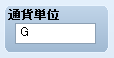

# 用語

- [［武器 1］、［武器 2］の名称変更](#01)
- [［通貨単位］の名称変更](#02)

## ［武器１］、［武器２］の名称変更

装備欄での部位名称が「武器」で統一されたため、VX Ace では廃止されました。

## ［通貨単位］の名称変更

ゲームで使用する通貨単位を設定する方法です。

［システム］通貨単位

- ［システム］タブで設定するように変更されました。

---
