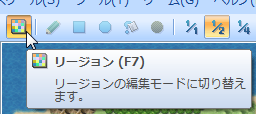
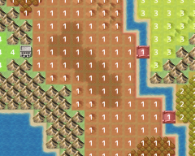
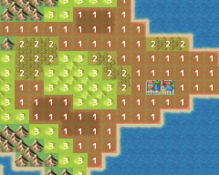
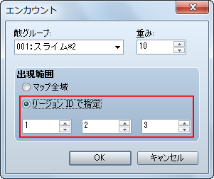
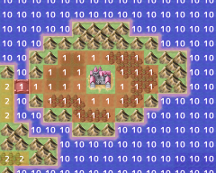

# マップ

- [［エリアの作成］](#01)

## ［エリアの作成］

敵グループとのエンカウント範囲を指定出来る「エリア」は、VX Ace では「リージョン」と名前を変え、より柔軟な範囲指定が可能になりました。

###### リージョンの設定

リージョンを設定するには、画面上部にあるアイコンボタンの中から［リージョン］をクリックし、リージョン編集モードに切り替えます。すると、タイルパレットにリージョン設定タイルが表示されますので、マップタイルを配置するのと同じ要領で、マップビューにリージョン設定タイルを配置していってください。

リージョン設定タイルには、あらかじめリージョン ID が割り振られていますので、同じリージョンにしたい場所には同じリージョン設定タイルを配置するようにしてください。

 ●リージョンの範囲をマップのレイアウトに合わせて設定出来る

 ●リージョンの範囲を飛び地にすることも出来る

###### エンカウントする範囲を設定する

［マップの設定］でエンカウントする敵グループを設定する際に、［出現範囲］を［リージョン ID で指定］することが出来ます。その敵グループを出現させたいリージョンの ID を、ここで設定してください。1 つの敵グループごとに、リージョン ID は 3 つまで設定出来ます。

###### 海の敵を設定する

VX Ace では、船に乗っている時も敵グループとエンカウントするようになりました。ですので、海にリージョンを設定して、そのリージョン ID の範囲内でのみエンカウントする敵グループを用意すれば、海でのみエンカウントする敵を設定することが出来ます。

---
