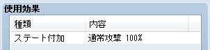
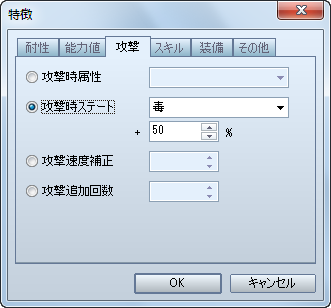

# ＶＸユーザーへのＴＩＰＳ

- [通常攻撃の命中率について](#01)
- [ステート「通常攻撃」について](#02)
- [敵の行う「毒攻撃」や「暗闇攻撃」などについて](#03)
- [VX のグラフィック素材を VX Ace で使う](#04)

ここでは、VX ユーザーが戸惑うであろうポイントについて解説します。

## 通常攻撃の命中率について

通常攻撃の命中率は、VX では装備している武器の命中率（素手の時は 95%）がそのまま適用されていましたが、VX Ace では、［アクター］、［職業］、［武器］、［防具］、［ステート］の特徴として設定された命中率を足した数値が適用されます。したがって、VX の時と同じ感覚で武器の命中率を設定すると、［武器］以外に設定された命中率と足された結果、最終的な命中率が 100% を超えてしまう可能性があります。

VX Ace では、［アクター］と［職業］の特徴として設定された命中率を足した数値が素手の時の命中率になりますので、そのキャラクターの基本的な命中率は［アクター］や［職業］で設定し、［武器］、［防具］、［ステート］の 3 つには、その基本的な命中率を補正する数値を設定すると良いでしょう。

## ステート「通常攻撃」について

［スキル］や［アイテム］の［使用効果］には［ステート付加］を設定出来ますが、そこで選択出来るステートの中に、［ステート］タブでは設定が出来ない「通常攻撃」というものがあります。これは、装備中の武器に設定されている［攻撃時ステート］を引き継ぐステートです。

例えば、通常攻撃よりも大きなダメージを与える「パワースラッシュ」というスキルを作成し、ステート「通常攻撃」を付加するよう設定したとします。そして、この「パワースラッシュ」を使用すると、普通の武器を装備している時は大きなダメージを与えるだけですが、通常攻撃時に「毒」を付加する武器を装備していれば「パワースラッシュ」にも「毒」を付加する効果が追加されますし、「睡眠」を付加する武器を装備していれば「パワースラッシュ」には「睡眠」を付加する効果が追加されるようになります。

## 敵の行う「毒攻撃」や「暗闇攻撃」などについて

VX では、「毒攻撃」や「暗闇攻撃」といった追加効果を伴う通常攻撃がスキルに用意されていましたが、VX Ace ではなくなっています。そういった攻撃をする敵を作成したい場合は、スキルとして新たに用意するのではなく、以下の方法で設定してください。

［敵キャラ］特徴－攻撃－攻撃時ステート

- 行動パターンには［攻撃］を設定するだけで、指定した確率で敵の通常攻撃に追加効果が発生するようになります。

## ＶＸのグラフィック素材をＶＸ Ａｃｅで使う

VX Ace では、VX のグラフィック素材をほぼそのまま使用することが出来ますが、一部変更されたものがありますので、グラフィック素材の流用を考えている場合は以下の表を参考にしてください。

| 素材名 | 収納フォルダ | 備考 |
| --- | --- | --- |
| キャラクター | Graphics/Characters | |
| 顔グラフィック | Graphics/Faces | |
| 敵キャラ | Graphics/Battlers | |
| アニメーション | Graphics/Animations | |
| タイルセット | Graphics/Tilesets | ●フォルダの位置が変更になっています ●設定時にモードを［VX 互換タイプ］にしてください |
| 遠景 | Graphics/Parallaxes | |
| フキダシアイコン | Graphics/System | |
| メッセージ背景 | ---------- | ●使用出来ません（※） |
| アイコン | Graphics/System | |
| 戦闘開始時効果 | Graphics/System | |
| 戦闘画面床 | ---------- | ●VX Ace では廃止されたため使用出来ません |
| 飛行船の影 | Graphics/System | |
| タイトル | Graphics/Titles1 | ●フォルダの位置が変更になっています |
| ゲームオーバー | Graphics/System | |
| ウィンドウスキン | Graphics/System | |
| ピクチャ | Graphics/Pictures | |

- 「メッセージ背景」は、グラフィック素材によってではなく、スクリプトの Window_Message#create_back_bitmap にて描画するよう変更されています。

---
